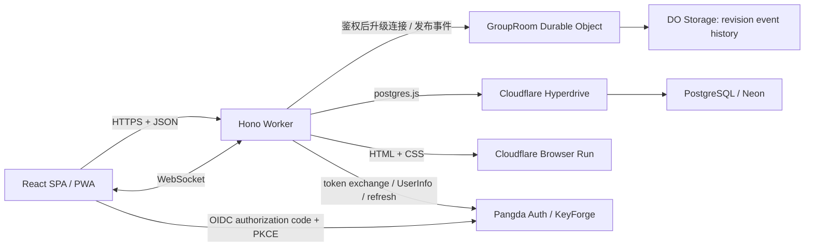

# AAEasy

AAEasy 是一个 Cloudflare-native 的多人分账 PWA。前端、API、实时协作、附件和 PDF 导出均已迁移到 Cloudflare Workers 技术栈；PostgreSQL 继续作为关系数据的唯一事实来源。

## 当前架构



| 层 | 实现 |
| --- | --- |
| 前端 | Vite、React 19、React Router、TanStack Query、Tailwind CSS |
| API | Cloudflare Worker + Hono |
| 数据 | Drizzle ORM + Postgres.js + Hyperdrive；推荐 Neon 作为托管 PostgreSQL |
| 实时 | Durable Objects + WebSocket Hibernation；不再使用 PostgreSQL `LISTEN/NOTIFY` |
| 登录 | Pangda Auth（KeyForge）OIDC authorization code + PKCE；应用只保留加密的服务端会话 |
| 导出 | CSV + Cloudflare Browser Run PDF；**不再提供 XLSX** |
| 国际化 | `use-intl`，中文 / English |
| 测试 | Vitest、TypeScript、ESLint、Wrangler dry-run |

已移除 Next.js、Prisma、`pg` 实时通知、Vercel Blob、React PDF、ExcelJS、小票附件（R2）、AI 记账和生产容器镜像。

## 本地运行

需要 Node.js 22.12+、pnpm 10+ 和 PostgreSQL。仓库中的 `docker-compose.yml` 只用于可选的本地 PostgreSQL，不参与生产部署。

```sh
pnpm install
docker compose up -d postgres

cp .env.example .env
cp .dev.vars.example .dev.vars

pnpm db:migrate
pnpm dev
```

打开 `http://localhost:5173`。默认 `wrangler.jsonc` 会把本地 `HYPERDRIVE` binding 连接到 `localhost:5432`；也可以导出以下变量覆盖它：

本地登录使用运行在 `http://localhost:17001` 的 KeyForge。确保它已启动后运行：

```sh
pnpm auth:setup
```

该脚本会用 `admin` / `admin` 登录 KeyForge，创建（或修复并轮换）`aaeasy` client 与所需 resource，再把一次性 client secret 写入 `.dev.vars`。可重复执行；凭据与地址可用 `KEYFORGE_USER`、`KEYFORGE_PASSWORD`、`KEYFORGE_URL`、`APP_URL` 覆盖。

回环 issuer 只在 `ENVIRONMENT` 不为 `production` 时被接受，生产 Worker 仍然只能指向 Pangda Auth。手动配置步骤见 [`docs/deployment/cloudflare.md`](docs/deployment/cloudflare.md)。

```sh
export CLOUDFLARE_HYPERDRIVE_LOCAL_CONNECTION_STRING_HYPERDRIVE='postgresql://...'
pnpm dev
```

日常开发必须使用 `pnpm dev`，由 Cloudflare Vite plugin 同时提供 SPA 和 Worker。直接执行 `wrangler dev` 不会编译前端，因此在 `dist/client` 尚不存在时访问 `/` 会得到 `{"error":"NOT_FOUND"}`。如需单独验证 Wrangler 的构建产物，使用：

```sh
pnpm dev:wrangler
```

该命令会先生成 `dist/client` 再启动 Wrangler，不提供 Vite 前端热更新。

本地 Worker secrets 放在 `.dev.vars`，Drizzle CLI 的直连数据库 URL 放在 `.env`。不要提交这两个文件。

## 数据库

应用 schema：

```sh
pnpm db:migrate
```

`drizzle/0000_baseline.sql` 可从空库建立初始 schema；后续 migration 按 `drizzle/meta/_journal.json` 顺序增量应用。

`0003_tighten_ledger_invariants.sql` 会在加约束前清理历史数据：退役没有金额/汇率/分摊规则的草稿行、断开失效的分享链接引用、释放大小写冲突的用户名、解绑同组重复绑定的成员。执行前建议先备份。

连接串中的 `schema=public` 会由迁移工具自动移除；Postgres.js 会把该参数误当成 PostgreSQL server 配置，因此不要在 `.env` 中使用它。

## Cloudflare 部署

生产配置位于 `wrangler.jsonc` 的 `env.production`。部署前必须替换：

- `HYPERDRIVE` 的全零占位 ID；
- 如有需要，PDF 启动间隔。

然后在 `auth.pangda.app` 创建生产 OAuth client、配置 Worker secrets 并执行：

```sh
pnpm deploy
```

`pnpm build` 会显式设置 `CLOUDFLARE_ENV=production`，确保 Vite 生成的扁平 Wrangler 配置使用生产 binding。`pnpm deploy` 还会先运行配置检查，避免把本地 Hyperdrive 或 `localhost` origin 部署到生产。

资源创建、secret、域名、Browser Run 配额和上线检查详见 [`docs/deployment/cloudflare.md`](docs/deployment/cloudflare.md)。

## PDF 方案

PDF 不需要 Container。Worker 生成经过 HTML 转义的专用账本页面，再通过 Cloudflare Browser Run 的 Puppeteer binding 打印为 A4 PDF。运行时自带 Noto CJK 字体，因此中文不需要把大字体文件打进 Worker bundle。

默认 `PDF_LAUNCH_INTERVAL_MS=20000`，兼容 Browser Run Free 的新浏览器启动频率。使用 Workers Paid 后可按账户配额改为 `1000`。每次渲染都在 `finally` 中关闭 browser session。

## 常用命令

```sh
pnpm dev             # 本地 Worker + SPA
pnpm dev:pdf         # 使用远程 Browser Run binding 测试 PDF（消耗账户配额）
pnpm build           # 使用 production Cloudflare environment 构建
pnpm build:local     # 使用顶层本地 bindings 构建
pnpm typecheck       # SPA、共享包和 Worker 类型检查
pnpm lint            # ESLint
pnpm test            # Vitest
pnpm format:check    # Prettier 检查
pnpm check           # 全量质量检查
pnpm cf:typegen      # 重新生成 Cloudflare binding 类型
pnpm db:generate     # 生成新的 Drizzle migration
pnpm db:migrate      # 应用 migration
pnpm db:studio       # Drizzle Studio
```

## 目录

```text
src/                  React SPA、页面、组件和客户端 action wrappers
worker/src/           Hono API、Durable Objects、PDF、认证
packages/contracts/   API schema 与 DTO
packages/core/        金额、分摊、账本与清算纯函数
packages/db/          Drizzle schema 和 Postgres.js client
drizzle/              可从空库执行的 baseline migration
scripts/              配置检查、本地登录初始化
docs/                 架构与部署手册
```

## 安全边界

- 所有写请求经过 Hono CSRF origin 校验和身份 / 分享 scope 校验。
- AAEasy 不接收或保存密码、Passkey 等登录凭据；浏览器登录只能跳转到 Pangda Auth。
- OIDC state、nonce 与 PKCE verifier 使用短期加密 Cookie；访问、刷新和 ID token 使用服务端 AES-GCM 加密后保存。
- KeyForge 用户禁用、授权撤销和 `admins` 组变化会在会话重新校验时生效。
- 分享解锁、用户搜索和 PDF 导出由 Durable Object 限流；用户搜索只做前缀匹配，避免遍历用户目录。
- 分享访客不能导出完整账本；只读分享不能写费用。
- 权限只在服务端判定一次（`accessDto`），客户端不从 `role` 重新推导。
- 费用写入使用 `version` 乐观锁，账本事件使用单调 `revision` 自愈断线缺口。
- 成员/角色/分享链接/邀请/结算等写操作都会写入 `audit_logs`，并附带 before/after。
- CSV 会转义 RFC 4180 特殊字符并中和 spreadsheet formula injection。
