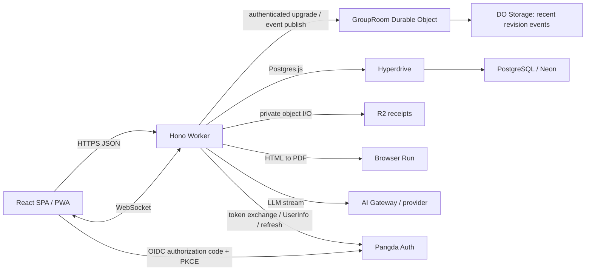

# AAEasy Cloudflare Workers 全量迁移 RFC

## 状态

- 实施状态：代码迁移已完成；生产资源 ID、最终域名和数据切流由部署阶段填写。
- 最近更新：2026-07-15。
- 明确移除：Next.js、Prisma、PostgreSQL `LISTEN/NOTIFY`、Vercel Blob、React PDF、ExcelJS / XLSX、生产 Container。
- 保留：React UI、匿名分享、AI 流式解析、CSV、PDF、PWA；登录统一迁移到 Pangda Auth OIDC。

## 架构决策

最终技术栈：

- 前端：Vite + React 19 SPA + React Router。
- HTTP：Hono，与静态资源部署在同一个 Cloudflare Worker。
- 数据库：PostgreSQL；推荐 Neon，Worker 统一通过 Hyperdrive 连接。
- ORM：Drizzle ORM + Postgres.js。
- 实时：每个账本一个 Durable Object，使用 WebSocket Hibernation API。
- 文件：私有 R2 bucket，Worker 负责鉴权、限流、上传和下载。
- PDF：Cloudflare Browser Run Puppeteer binding，把专用 HTML/CSS 打印为 PDF。
- 限流：RateLimiter Durable Object。
- 身份：Pangda Auth / KeyForge OIDC authorization code + S256 PKCE；AAEasy 不保存登录凭据。

Hyperdrive 和 Neon 不是互斥选项：Neon 提供 PostgreSQL，Hyperdrive 提供 Worker 侧连接复用和快速路由。应用保留交互式事务，因此不改用 Neon HTTP driver。

## 目标拓扑



PostgreSQL 是业务数据的唯一事实来源。DO 不保存完整账本，只保存最近 256 个 compact events 和活跃 WebSocket。

## 为什么使用 SPA + Hono

应用的大部分交互本来就在客户端完成，登录后的账本也没有关键 SEO 需求。直接迁移为 SPA 可以：

- 删除 Server Actions、RSC 和 `next/*` 导航耦合；
- 用稳定的 JSON DTO 明确 bigint、decimal 和 date 序列化；
- 让同一 Hono Worker 统一处理 API、WebSocket、R2 和 PDF；
- 避免为了兼容旧框架继续维护 OpenNext 适配层。

现有组件通过小型 React Router compatibility helpers 迁移，随后 compatibility 文件也已使用中性命名，不依赖 Next runtime。

## 数据层

`packages/db/src/schema.ts` 当前定义 15 张 Drizzle PostgreSQL 表。迁移目录包含：

- `0000_baseline.sql`：可从空数据库建立完整 schema；
- `0001_cloudflare-revisions.sql`：增加 `groups.revision` 和 `expenses.version`；
- `0002_lucky_sentinels.sql`：保留业务用户 ID，删除本地凭据/注册表并把 session 切换为加密 OIDC token set；
- Drizzle snapshots 和 journal。

两种数据库路径：

1. 新库运行 `pnpm db:migrate`；
2. 既有 Prisma schema 运行 `pnpm db:adopt -- --yes`，验证表后登记 baseline。

Worker 在每次请求中创建独立的 Postgres.js / Drizzle client，不在全局作用域缓存连接。边缘连接会随请求结束自动清理，底层数据库连接复用由 Hyperdrive 负责。

费用更新使用 `expenses.version` 乐观锁；每次账本级变更在同一 PostgreSQL transaction 中递增 `groups.revision`。

## 实时协议

写入路径：

```text
Browser -> Hono auth -> PostgreSQL transaction
                         -> mutation
                         -> increment groups.revision
                       commit
       -> publish compact event to GroupRoom
       -> return mutation result
```

事件只用于缓存失效，不携带账本正文：

```ts
type GroupEvent = {
  revision: string;
  type:
    | 'expense.created'
    | 'expense.updated'
    | 'expense.deleted'
    | 'receipt.changed'
    | 'member.changed'
    | 'group.updated'
    | 'settlement.changed';
  entityId?: string;
  actorId?: string;
  occurredAt: string;
};
```

浏览器连接时带 `since` revision。DO 的行为：

- revision 连续且仍在 256 条历史窗口内：重放缺失事件；
- 缺口超出窗口、客户端 revision 超前或没有 revision：发送 `resync`；
- 客户端收到 event 或 resync 后 invalidates TanStack Query 并重拉 PostgreSQL 快照；
- WebSocket 断线采用 jittered exponential backoff 重连，并发送 heartbeat。

数据库提交和 DO publish 不存在跨存储事务。若 publish 失败，后续连接会发现 revision 缺口并 resync；API 写入本身不回滚。

## R2 小票

- 文件上限 5 MiB，允许 JPEG、PNG、WebP、GIF、HEIC 和 PDF。
- Worker 对 request body 做流式上限检查，避免无 `Content-Length` 时读入超大 body。
- object key 使用 `groups/{groupId}/expenses/{expenseId}/{random}.{ext}`。
- R2 先写、数据库后写；数据库失败时删除刚写入的对象。
- 删除 receipt 时先提交数据库，再通过 `waitUntil` 删除 R2 object。
- 删除拥有者账号时一次性事务删除数据库数据，并分批清理关联 R2 objects。
- bucket 始终私有，下载必须通过 Worker 的 group access check。

旧对象按数据库 `receipts.objectKey` 原样复制。仓库提供 provider-neutral JSONL importer，详见 [`data-cutover.md`](data-cutover.md)。

## PDF 与 CSV

PDF endpoint：

1. 要求登录用户具备账本读取权限；分享 session 不允许完整导出。
2. 从 PostgreSQL 读取 ledger snapshot。
3. 生成全部用户文本均经过 HTML escape 的打印页。
4. 启动 Browser Run session，`setContent()` 后调用 `page.pdf()`。
5. 使用 A4 landscape、打印背景、CSS page size 和 `waitForFonts`。
6. 在 `finally` 中关闭 browser，直接返回 `application/pdf`。

Browser Run 运行时已预装 Noto CJK，CSS 优先使用 `Noto Sans CJK SC`，无需打包大型字体，也不需要 Container。默认全局 browser launch 间隔是 20 秒，兼容 Free 套餐；Paid 可按配额调低。

CSV 在 Worker 内纯字符串生成，保留 UTF-8 BOM、RFC 4180 quoting，并中和 spreadsheet formula injection。XLSX 被彻底删除。

## 安全

- Hono `csrf()` 校验写请求 origin，`secureHeaders()` 应用于全部 API。
- Session 和 share token 只以 SHA-256 hash 入库，cookie 为 HttpOnly、SameSite=Lax，HTTPS 下 Secure。
- OIDC state、nonce、PKCE verifier 和服务端 token set 使用独立 32-byte secret 做 AES-GCM 加密；issuer 被限制为 Pangda Auth production/staging。
- KeyForge 负责登录限流和凭据安全；AAEasy 的 AI、成员搜索、分享 unlock 和 PDF 继续在 Worker 内限流。
- Group access 统一区分 OWNER、MANAGER、MEMBER、VIEWER、READ share 和 WRITE share。
- 只读 share 不具备 `WRITE_EXPENSE`；成员写入受 linked member / bound member 约束。
- 费用修改和删除检查 optimistic version，settled expense 保持锁定。

## 代码边界

```text
src/spa/              router、页面、query client、客户端 action wrappers
src/components/       React UI
worker/src/routes/    Hono API
worker/src/auth/      OIDC、服务端 session、group access、claim
worker/src/durable-objects/
worker/src/export/    CSV 与 Browser Run PDF
worker/src/storage/   R2 key、body limit、批量清理
packages/core/        money、split、ledger、settle 纯函数
packages/contracts/   Zod 输入、DTO、事件协议
packages/db/          Drizzle schema 和 Hyperdrive client
drizzle/              baseline、revision migration、metadata
```

## 实施结果

- React SPA、Hono API、Drizzle 数据层、Pangda Auth OIDC、分享、邀请、结算、AI、PWA 已迁移。
- `GroupRoom` 和 `RateLimiter` Durable Objects 已实现并配置 migrations。
- PostgreSQL 新库 migration 与旧 schema adoption 均在临时数据库验证通过。
- R2 raw upload、鉴权下载、删除和账号级对象清理已实现。
- Browser Run PDF 和 Worker-native CSV 已实现。
- Next、Prisma、Vercel Blob、React PDF、ExcelJS、`pg` 和生产 Dockerfile 已移除。
- 类型检查、ESLint、107+ Vitest tests、Vite production build 和 Wrangler dry-run 已接入。

生产上线只剩外部状态：创建真实 Hyperdrive / R2、在两个 KeyForge 环境注册 AAEasy resource/client、设置 secrets、复制生产数据和切域名。执行手册见 [`../deployment/cloudflare.md`](../deployment/cloudflare.md) 与 [`data-cutover.md`](data-cutover.md)。
